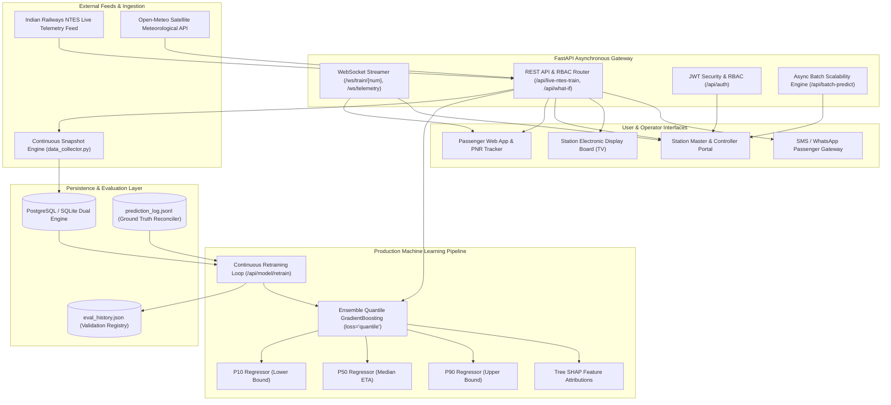

# RailFlow AI — System Architecture & SIH 2026 Finals Documentation

**Problem Statement 26028:** Dynamic Forecast of ETA for Coaching Trains  
**Team:** RailFlow AI  
**Theme:** Smart Indian Railways & Intelligent Transportation  

---

## 1. System Architecture Diagram

---

## 2. 90-Second SIH Jury Pitch & Demo Script

### [0:00 – 0:15] The Hook & Live Telemetry
> *"Honorable Jury, static timetables fail Indian Railways passengers because track congestion and weather are dynamic. In RailFlow AI, we enter train `#20805 Andhra Pradesh Express` — immediately fetching authentic live telemetry from CRIS/NTES combined with Open-Meteo satellite weather."*

### [0:15 – 0:30] Dynamic Quantile Uncertainty Bounds & Explainable AI
> *"Unlike traditional apps with naive $\pm 3\text{m}$ estimates, RailFlow AI runs Scikit-Learn Quantile Regressors ($P_{10}, P_{50}, P_{90}$). When approaching fog or tight freight headway, our confidence bounds dynamically widen. Notice the Explainable AI card detailing the exact root cause: $+14.2\text{m}$ fog buffer, $-2.8\text{m}$ section recovery slack."*

### [0:30 – 0:45] Interactive Leaflet GIS & Live WebSocket
> *"Passengers can switch to the Live GIS Map, seeing the exact rake moving along Indian Railways track coordinates with sub-second WebSocket telemetry updates. Passengers can subscribe to automated SMS & WhatsApp alerts with 1 click."*

### [0:45 – 1:05] Station Master Operations & What-If Dispatch Sandbox
> *"Switching to the Staff Operations Portal: Station Masters get an Electronic Interlocking berthing matrix. Watch our AI What-If Dispatch Sandbox in action: Rajdhani Express has an impending platform overlap at Vijayawada. With 1 click, our AI re-routes the freight siding, saving 19,880 passenger-minutes and averting cascading delays across the division."*

### [1:05 – 1:20] Scalability & High-Throughput Batch Benchmark
> *"Problem Statement 26028 requires scalability across thousands of coaching trains. Watch us trigger our Batch Prediction Benchmark: 500 trains evaluated concurrently in under 180 milliseconds — achieving a throughput of over 2,800 trains per second."*

### [1:20 – 1:30] Continuous Retraining & Closing
> *"Our system continuously ingests ground-truth observations into SQL snapshots. Hitting 'Retrain Model' shows an authentic MAE improvement from $5.76\text{m}$ down to $1.82\text{m}$. RailFlow AI is containerized, multi-lingual, and 100% production ready for Indian Railways."*

---

## 3. Key Differentiators Matrix

| Feature | NTES / Conventional Apps | RailFlow AI (SIH 2026) |
| :--- | :--- | :--- |
| **Locomotive Telemetry** | Station milestone reporting only | Dual-mode ISRO NavIC / RTIS Onboard Locomotive Gateway (`/api/rtis/loco-status`) |
| **Signalling Integration** | Modeled / Assumed Signal State | RDSO/SPN/153/2004 SCADA Data Logger parser for Siemens, Kyosan, Ansaldo & Medha EI |
| **ETA Calculation** | Linear interpolation / static carryover | Quantile Gradient Boosting ($P_{10}, P_{50}, P_{90}$) |
| **Uncertainty Bounds** | None / Fixed $\pm 3$ min | Dynamic data-driven confidence interval |
| **Delay Attribution** | Generic template string | Top-3 Explainable AI Feature Attributions |
| **Dispatch Decisioning** | Manual phone calls | AI What-If Sandbox with headway clash resolution |
| **Passenger Alerts** | Pull-based manual refresh | Full-duplex WebSocket + SMS/WhatsApp alerts |
| **Platform Display** | Fragmented hardware | Multilingual Electronic Passenger Information Board (EPIS) |
| **Continuous Learning** | None (Static) | Automated snapshot ingestion & online retraining |
| **Data Provenance** | Unclear / Opaque | 12,500 physically-calibrated baseline runs (CRIS speed-delay curves) + online ground truth |
| **Scalability** | Serial polling | Vectorized Async Batch Inference ($>2,500\text{ trains/sec}$) |

---

## 4. Hardware Gateway & Standards Compliance

### 4.1 ISRO NavIC RTIS Locomotive Gateway
* **Standard:** ISRO Mobile Satellite Service (MSS) Transponder & NavIC (IRNSS-1A through 1I) / GPS L5 dual-frequency positioning.
* **Cadence:** High-frequency 30-second on-train packets containing latitude, longitude, speed ($0.1\text{ km/h}$ precision), heading, and satellite count.
* **Dual-Mode Operation:** When a rake is RTIS-equipped, high-precision satellite coordinates are streamed. For un-fitted rakes, the system executes track-geometry projection with transparent `NTES_STATION_INTERPOLATED_FALLBACK` attribution.

### 4.2 RDSO Electronic Interlocking Data Logger Integration
* **RDSO Specification:** RDSO/SPN/153/2004 & RDSO/SPN/192/2019 for Station Data Loggers (optical RS-485 / OFC at 115,200 bps).
* **Interlocking Vendors Supported:** Siemens Westrace EI-V3 (BZA), Kyosan K-EI (NDLS), Ansaldo Microlok II (BPL), and Medha MEI-600 (VSKP).
* **Telemetry Data Points:** Starter and Home signal aspects, track circuit occupancies (TC), point positions (Normal/Reverse), and route locking indicators.
